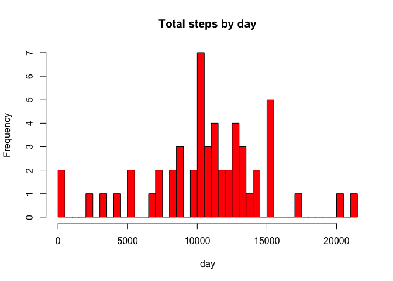
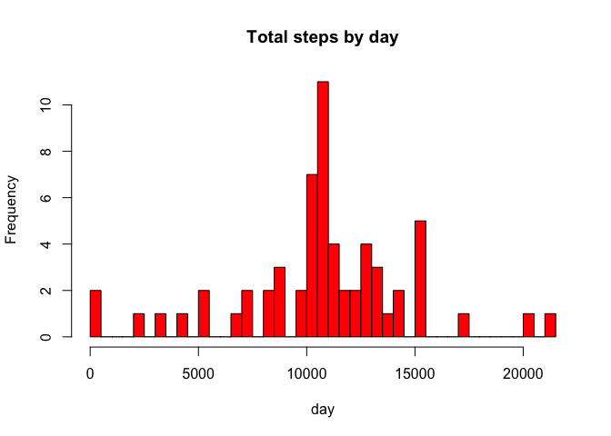

# Reproducible Research: Peer Assessment 1


## Loading and preprocessing the data
1. Load the data (i.e. `read.csv()`)

```r
activity <- read.csv("activity.csv")
```

2. Process/tranform the data (if necessary) into a format suitable for your analysis


## What is mean total number of steps taken per day?
1. Make a histogram of the total number of steps taken each day

```r
steps_per_day <- aggregate(steps ~ date, data = activity, FUN = sum)
hist(steps_per_day$steps, main = "Total steps by day", xlab = "day", breaks = nrow(steps_per_day), col = "red")
```

 

2. Calculate and report the **mean** and **median** total number of steps taken per day

```r
mean_steps <- mean(steps_per_day$steps)
median_steps <- median(steps_per_day$steps)
```

The **mean** is 1.0766189\times 10^{4} and the **median** is 10765.

## What is the average daily activity pattern?

1. Make a time series plot (i.e. `type = "l"`) of the 5-minute interval (x-axis) and the average number of steps taken, averaged across all days (y-axis)

```r
intervals <- aggregate(steps ~ interval, data = activity, FUN = mean)
plot(intervals, type = "l")
```

 

2. Which 5-minute interval, on average across all the days in the dataset, contains the maximum number of steps?

```r
intervals$interval[which.max(intervals$steps)]
```

```
## [1] 835
```

## Imputing missing values

Note that there are a number of days/intervals where there are missing
values (coded as `NA`). The presence of missing days may introduce
bias into some calculations or summaries of the data.

1. Calculate and report the total number of missing values in the dataset (i.e. the total number of rows with `NA`s)

```r
sum(is.na(activity))
```

```
## [1] 2304
```

2. Devise a strategy for filling in all of the missing values in the dataset. The strategy does not need to be sophisticated. For example, you could use the mean/median for that day, or the mean for that 5-minute interval, etc.

I'll use the mean for that 5-minute interval to fill in missing values in the dataset.

3. Create a new dataset that is equal to the original dataset but with the missing data filled in.


```r
activity <- merge(activity, intervals, by = "interval", suffixes = c("", ".y"))
nas <- is.na(activity$steps)
activity$steps[nas] <- activity$steps.y[nas]
activity <- activity[, c(1:3)]
```

4. Make a histogram of the total number of steps taken each day and Calculate and report the **mean** and **median** total number of steps taken per day. Do these values differ from the estimates from the first part of the assignment? What is the impact of imputing missing data on the estimates of the total daily number of steps?


```r
steps_per_day <- aggregate(steps ~ date, data = activity, FUN = sum)
hist(steps_per_day$steps, main = "Total steps by day", xlab = "day", breaks = nrow(steps_per_day), col = "red")
```

 


```r
mean_steps <- mean(steps_per_day$steps)
median_steps <- median(steps_per_day$steps)
```

The **mean** is 1.0766189\times 10^{4} and the **median** is 1.0766189\times 10^{4}.

## Are there differences in activity patterns between weekdays and weekends?

1. Create a new factor variable in the dataset with two levels -- "weekday" and "weekend" indicating whether a given date is a weekday or weekend day.


```r
daytype <- function(date) {
    if (weekdays(as.Date(date)) %in% c("Saturday", "Sunday")) {
        "weekend"
    } else {
        "weekday"
    }
}
activity$daytype <- as.factor(sapply(activity$date, daytype))
```

2. Make a panel plot containing a time series plot (i.e. `type = "l"`) of the 5-minute interval (x-axis) and the average number of steps taken, averaged across all weekday days or weekend days (y-axis).


```r
library(lattice)
steps_by_interval <- aggregate(activity$steps ~ activity$interval + activity$daytype, data = activity, FUN = mean)

names(steps_by_interval) <- c("interval", "daytype", "steps")

xyplot(steps ~ interval | daytype, steps_by_interval, type = "l", layout = c(1, 2), 
       xlab = "Interval", ylab = "Number of steps")
```

 
